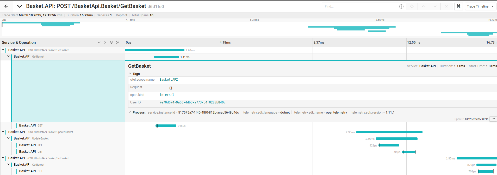
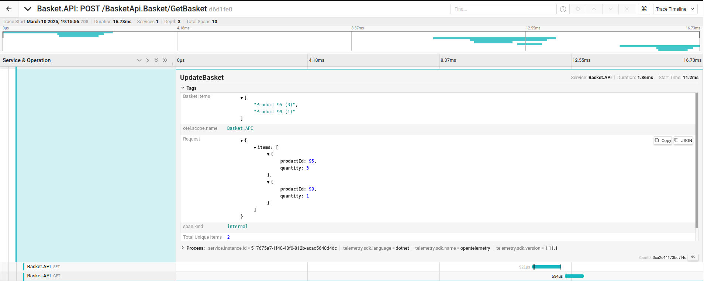
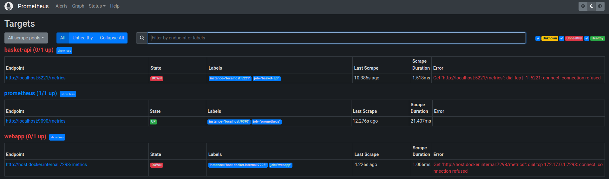

# Assignment 1 - AS

## Project information

#### Student
Guilherme Amorim
107162

#### Github repository
https://github.com/GuiAmorim03/AS_Assign1_eShop


## Work developed for the project
The next section, describes all the steps taken during the development of the project.

### Add dependencies

At src/Basket.API/

```sh
dotnet add package OpenTelemetry
dotnet add package OpenTelemetry.Exporter.OpenTelemetryProtocol
dotnet add package OpenTelemetry.Exporter.Jaeger
dotnet add package OpenTelemetry.Extensions.Hosting
dotnet add package OpenTelemetry.Instrumentation.AspNetCore
dotnet add package OpenTelemetry.Instrumentation.Http
dotnet add package OpenTelemetry.Instrumentation.SqlClient
```

### Run Jaeger

```sh
docker run --rm --name jaeger \
  -p 5778:5778 \
  -p 16686:16686 \
  -p 4317:4317 \
  -p 4318:4318 \
  -p 14250:14250 \
  -p 14268:14268 \
  -p 9411:9411 \
  jaegertracing/jaeger:2.0.0 \
  --set receivers.otlp.protocols.http.endpoint=0.0.0.0:4318 \
  --set receivers.otlp.protocols.grpc.endpoint=0.0.0.0:4317
```

Jaeger UI is available at http://localhost:16686

### Add OpenTelemetry libraries to connect to Jaeger

At src/eShop.AppHost/Program.cs


### Personalize metrics
Add tags to BasketService to the functions related to the basket actions

#### Results
[](./getBasket.png)
[](./updateBasket.png)

### Grafana

#### Start Prometheus

```sh
docker run -d --name prometheus -p 9090:9090 prom/prometheus
```

Add the dependency to the project

```sh
dotnet add package OpenTelemetry.Exporter.Prometheus
```


And add the Prometheus configuration to the builder in Program.cs

Prometheus UI is available at http://localhost:9090

#### Start Grafana

```sh
docker run --rm --name grafana -d -p 3000:3000 grafana/grafana
```

Grafana UI is available at http://localhost:3000

#### Add Prometheus as a data source

1. Access Grafana UI
2. Login with user: admin, password: admin
3. At Settings->Data Sources, choose Prometheus as a data source
4. Set the URL to http://localhost:9090

#### Results

Unfortunately, for unknown reasons, at Prometheus, the targets are always down, so the metrics are not being collected and for that reason, Grafana is not showing any data.
[](./prometheus.png)

## Conclusions

The goal of this assignment was to provide experience in integrating observability tools such as OpenTelemetry, Prometheus, Jaeger, and Grafana into a microservices architecture.

### Accomplishments

- Associate the Basket API with OpenTelemetry for tracing and metrics collection.
- Integration of Jaeger with that metrics collection. Personalization of metrics with tags.
- Deployment of Prometheus and Grafana: Configuration of Prometheus to collect metrics from the Basket API. Configuration of Grafana to use Prometheus as a data source.

### Struggles
- Prometheus targets are always down, so the metrics are not being collected and for that reason, Grafana is not showing any data.
- That main issue does not allow me to discover the full potential of these tools, what stop me from learning important concepts about tracking and monitoring.

### Final Thoughts
This assignment provided a great introduction to monitoring in microservices. It was interesting to explore many tools presented and understand how they fit together. However, it was also frustrating not being able to fully implement the monitoring setup due to the Prometheus issue. Fixing that problem would have allowed for a more complete learning experience. Even so, this project gave me a solid foundation to improve in the future.

